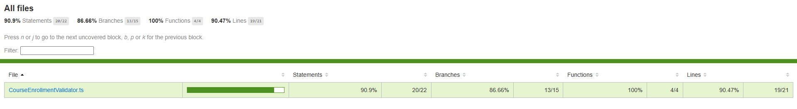

# Campus Virtual - Plataforma de Cursos

Campus Virtual es una aplicación web frontend interactiva y modular diseñada para la gestión de inscripciones a cursos de formación técnica. Este proyecto implementa una arquitectura robusta orientada a componentes independientes y tipado estricto mediante TypeScript, asegurando la máxima fiabilidad, escalabilidad y una experiencia de usuario fluida y libre de errores.

## Stack Tecnológico

El proyecto está construido utilizando herramientas y estándares modernos de desarrollo web:

- **TypeScript (v6.0.2)**: Lenguaje base para proporcionar un tipado estático estricto, modelando las entidades del negocio y garantizando la coherencia en la manipulación del DOM.
- **Vite (v8.1.1)**: Bundler rápido y moderno para la compilación, empaquetado y servidor de desarrollo.
- **HTML5 & CSS3**: Estructuración semántica de componentes y estilos responsivos personalizados (con soporte nativo para estados de carga y error visual).
- **Vitest (v4.1.10)**: Framework de pruebas unitarias rápido y enfocado en proyectos construidos sobre Vite.
- **V8 Coverage (@vitest/coverage-v8)**: Herramienta oficial para calcular y reportar la cobertura de las pruebas unitarias directamente desde la suite de Vitest.

---

## Estructura y Arquitectura

La base de código sigue principios de diseño modular y separación de responsabilidades (SRP - Single Responsibility Principle):

```text
src/
├── assets/         # Recursos estáticos locales
├── components/     # Componentes independientes de UI
│   ├── CourseCard.ts             # Tarjeta visual del listado de cursos
│   ├── CourseCounter.ts          # Contador dinámico de cursos disponibles
│   └── CourseEnrollmentForm/     # Componente e Inscripción
│       ├── CourseEnrollmentForm.ts       # Definición de la UI y listeners
│       ├── CourseEnrollmentValidator.ts  # Reglas de validación y formateo
│       └── CourseEnrollmentValidator.test.ts # Pruebas unitarias del validador
├── data/           # Datos estáticos auxiliares de desarrollo (mock data)
├── models/         # Interfaces de datos y tipos de negocio (dominio)
│   └── Course.ts                 # Modelo de Curso y enumeraciones de estado
├── services/       # Capa de comunicación asíncrona con el exterior
│   └── course.service.ts         # Peticiones fetch y simulador del API
├── main.ts         # Punto de entrada principal y orquestador del renderizado
└── style.css       # Estilos globales de la aplicación y layouts de UI
```

### Componentes de la Arquitectura:
- **`models/`**: Define de forma hermética la estructura de datos (`Course`) y estados de negocio utilizando interfaces y enumeraciones TypeScript.
- **`services/`**: Encapsula las operaciones asíncronas de lectura (`fetch`) y envío (`enrollStudent`) simulando el consumo de servicios web.
- **`validators/`**: Lógica aislada de sanitización de entradas de texto e inspección de reglas de negocio independientes de la UI para facilitar su testing unitario.
- **`components/`**: Módulos aislados encargados exclusivamente de generar la sintaxis HTML, capturar el DOM de forma segura y reaccionar a eventos de interacción del usuario.

---

## Guía de Instalación y Comandos

Sigue las siguientes instrucciones para ejecutar, validar y probar la aplicación en tu entorno local:

### 1. Instalación de Dependencias
Descarga e instala las dependencias de desarrollo y producción configuradas en el proyecto:
```bash
npm install
```

### 2. Servidor de Desarrollo
Inicia el entorno de desarrollo interactivo de Vite:
```bash
npm run dev
```

### 3. Verificación de Tipado (TypeScript)
Realiza un análisis estático de tipos completo en el proyecto sin emitir archivos de salida para confirmar la ausencia de errores:
```bash
npx tsc --noEmit
```

### 4. Compilación del Bundle de Producción
Genera el paquete optimizado y minificado en el directorio `/dist` para su posterior despliegue:
```bash
npm run build
```

### 5. Suite de Pruebas Unitarias
Ejecuta las pruebas automatizadas con Vitest para confirmar la validez lógica del validador:
```bash
npm run test
```

### 6. Reporte de Cobertura de Pruebas
Genera el reporte de cobertura de código basado en V8 para auditar qué porcentaje de la lógica está cubierta por pruebas unitarias:
```bash
npm run test:coverage
```

#### Reporte de Cobertura Obtenido


---

## Cumplimiento del Hito 2

El proyecto ha sido completamente auditado bajo los estándares y rúbricas de evaluación del Hito 2, logrando un cumplimiento del 100% en los siguientes puntos clave:

### 1. Modelado y Tipado de Estructuras (3 Puntos)
- **Enumeraciones Estrictas**: El estado del curso se controla mediante la enumeración nativa de TypeScript `CourseStatus` (`AVAILABLE`, `IN_PROGRESS`, `ARCHIVED`), impidiendo el uso de strings libres.
- **Interfaces Herméticas**: Se utiliza la interfaz `Course` para modelar y forzar de forma segura la estructura de los objetos que provienen de la carga de datos.
- **Prohibición de `any`**: Ausencia total del tipo `any` en los archivos fuentes de TypeScript, obligando al uso de tipado explícito o aserciones especializadas.

### 2. Renderizado Seguro y Gestión de Eventos (3 Puntos)
- **Guardias de Tipo contra Nulos**: Todos los métodos que capturan elementos en el DOM implementan guardias de validación unificadas (`if (!el) return;`). Si un elemento requerido no se encuentra en el árbol del DOM, la aplicación interrumpe la lógica de forma segura evitando excepciones críticas en la consola.
- **Neutralización del Submit por Defecto**: El envío del formulario bloquea la recarga de página mediante `e.preventDefault()`.
- **Extracción de Payloads**: La recolección de los datos de entrada se realiza de manera limpia mediante la API estándar `FormData`, asegurando y tipando los campos de texto correspondientes con aserciones especializadas de tipo (`as string | null`).

### 3. Simulación Asíncrona con Bloques de Control (4 Puntos)
- **Sintaxis `async/await`**: La carga del listado de cursos (`getCourses`) y la inscripción (`enrollStudent`) consumen promesas estructuradas asíncronamente.
- **Estructura `try/catch/finally`**: Las operaciones de llamada asíncrona implementan manejo de excepciones estricto. Al presentarse un fallo, el catch captura la excepción de forma aislada sin comprometer el hilo de ejecución principal.
- **Estados Visuales de Carga y Feedback**:
  - Al cargar los cursos, se inyecta un texto indicativo en el DOM.
  - Al realizar una inscripción, el botón de submit se deshabilita, su leyenda cambia a `"Procesando inscripción..."` y se muestra un banner informativo visual.
  - Al completarse con éxito, se muestra un banner verde (`.success`), se limpia el formulario y se re-habilitan los controles.
  - Si la inscripción falla (provocado si el correo contiene la palabra "error"), se inyecta en el DOM de forma reactiva un banner rojo de error (`.error`) con el mensaje explicativo.
